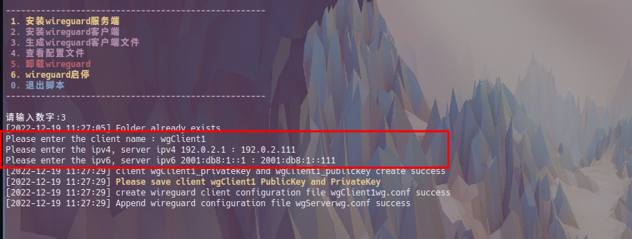

<!--
 * @Author: nightAsShadow 18962890925@163.com
 * @Date: 2022-12-18 19:09:04
 * @LastEditors: nightAsShadow 18962890925@163.com
 * @LastEditTime: 2022-12-18 19:09:26
 * @FilePath: /wireguardScript/README.md
 * @Description: 这是默认设置,请设置`customMade`, 打开koroFileHeader查看配置 进行设置: https://github.com/OBKoro1/koro1FileHeader/wiki/%E9%85%8D%E7%BD%AE
-->
# wireguardScript
wireguard安装卸载脚本

wireguard没有服务端和客户端之分，这里把有公网的服务器称为服务端

# 使用方法
## 服务端使用前修改参数
修改脚本中的几个参数

ipv4ServerAddress：服务端ipv4 ip

ipv6ServerAddress：服务端ipv6 ip

publicAddress：域名或者公网ip

UDPListenPort：端口，路由器需要映射此端口号

ClientAllowedIPs：需要转发的ip段

其中publicAddress为必须修改字段

生成客户端配置文件，需要输入客户端的hostname，自动生成hostname+wg.conf


## 脚本使用

### 服务端安装

1. su -  #需要root执行
2. chmod +x  wireguard.sh #给脚本执行权限
3. ./wireguard.sh 
4. 选择 1 开始安装
5. 选择网卡输入编号

PostUp/1PostDown启动停止VPN接口之后运行的命令，开启了转发 

 默认自动开机启动 
 


### 客户端安装
1. su - 
2. chmod +x  wireguard.sh #给脚本执行权限
3. ./wireguard.sh 
4. 选择2


### 客户端配置文件生成
1. ./wireguard.sh  #在服务端运行
2. 选择3 
3. 输入客户端名称 #客户端名称取客户端的hostname，生成的文件是hostname+wg.conf
4. 输入分配给该客户端的ipv4和ipv6地址




### 客户端配置文件查看

1. ./wireguard.sh  #在服务端运行
2. 输入4
3. 输入2
4. 输入客户端名称
5. 输入1查看文本形式


把配置写入到客户端中

```
    echo "
    
[Interface]
PrivateKey = SIYjdBsCE3nNmvaAIHm5LFmiPyp4PfIZZCvp9G28+Xw=
Address = 192.0.2.112/24,2001:db8:1::112/32
MTU = 1420

[Peer]
PublicKey = d7ltLmOvi/fnQNM9TwxCQCAvpgvFbFx9BDAREBL5gyc=
Endpoint = 192.168.100.110:12345
AllowedIPs = 192.0.2.0/24,2001:db8:1::0/32
PersistentKeepalive = 25

" | tee  /etc/wireguard/$(cat /etc/hostname)wg.conf  >/dev/null
```


### 客户端和服务端启动
1. ./wireguard.sh
2. 输入6
3. 输入1
4. 默认配置文件为hostname+wg.conf，也可以手动输入要启动的配置


### 卸载
1. ./wireguard.sh 
2. 选择5


# 问题
目前测试了debian11，ubuntu22.04。centos7，arch
使用过程中碰到问题请联系我，感谢!!!
