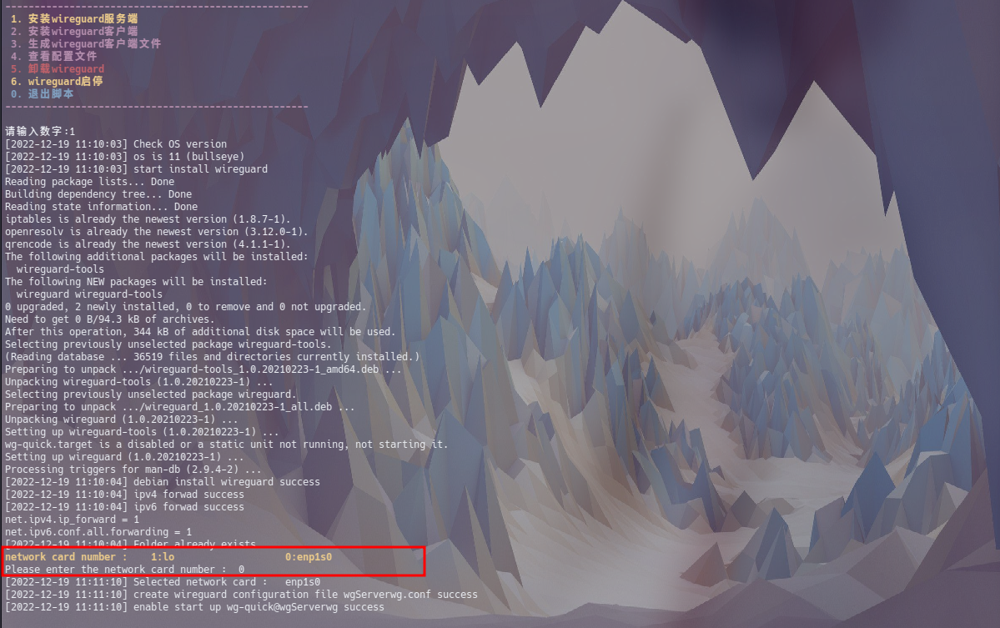
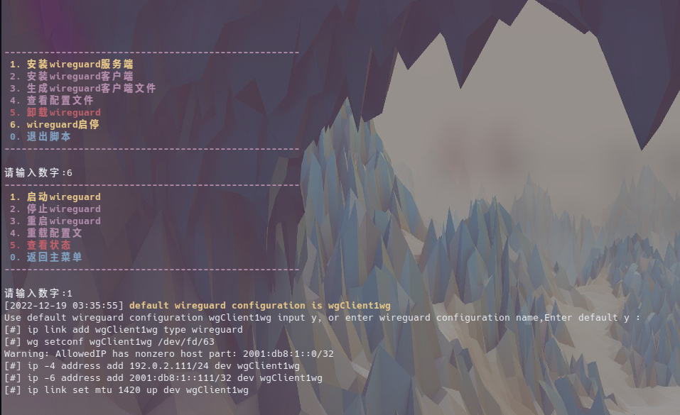
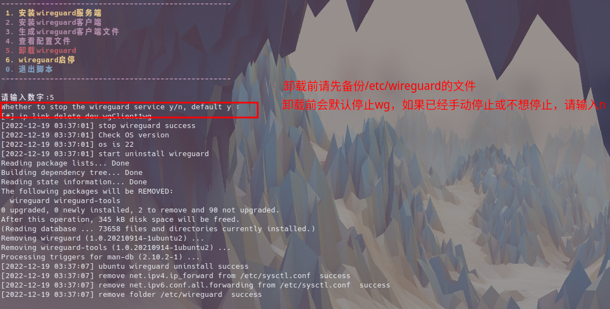

<!--
 * @Author: nightAsShadow 18962890925@163.com
 * @Date: 2022-12-18 19:09:04
 * @LastEditors: nightAsShadow 18962890925@163.com
 * @LastEditTime: 2022-12-18 19:09:26
 * @FilePath: /wireguardScript/README.md
 * @Description: 这是默认设置,请设置`customMade`, 打开koroFileHeader查看配置 进行设置: https://github.com/OBKoro1/koro1FileHeader/wiki/%E9%85%8D%E7%BD%AE
-->
# wireguardScript
wireguard安装卸载脚本

# 使用方法
## 使用前修改参数
修改脚本中的
ipv4ServerAddress
ipv6ServerAddress
publicAddress
UDPListenPort
ClientAllowedIPs
几个字段,
其中publicAddress为必须修改字段  
生成客户端配置文件，需要输入客户端的hostname，自动生成hostname+wg.conf  

## 脚本使用
### 服务端安装
su -  
chmod +x  wireguard.sh #给脚本执行权限 
./wireguard.sh  
选择1  
PostUp/1PostDown启动停止VPN接口之后运行的命令，开启了转发  
 默认自动开机启动  
  
### 启动
### 客户端安装
su -  
chmod +x  wireguard.sh #给脚本执行权限 
./wireguard.sh  
选择2  

  

### 客户端配置文件生成
./wireguard.sh  #在服务端运行 
选择3  
client name 取客户端的hostname，生成的文件是hostname+wg.conf 
输入分配给该客户端的ipv4和ipv6地址 

 

 
 

./wireguard.sh  #在服务端运行 
从服务端获取客户端的配置文件 

 
把配置写入到客户端中 

### 客户端和服务端启动
./wireguard.sh 
默认配置文件为hostname+wg.conf  

### 卸载
./wireguard.sh  
选择5  

 

# 问题
目前测试了debian11，ubuntu22.04。centos7，arch
使用过程中碰到问题请联系我，感谢!!!
